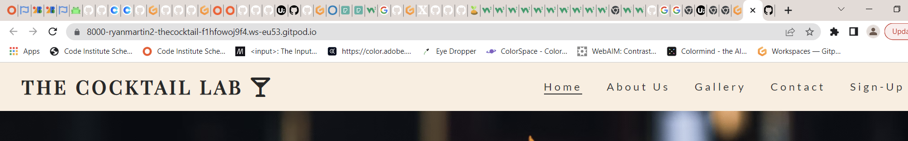
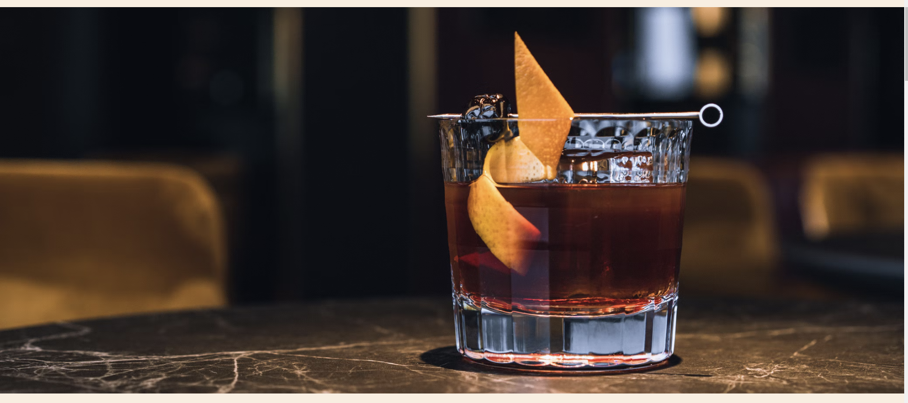
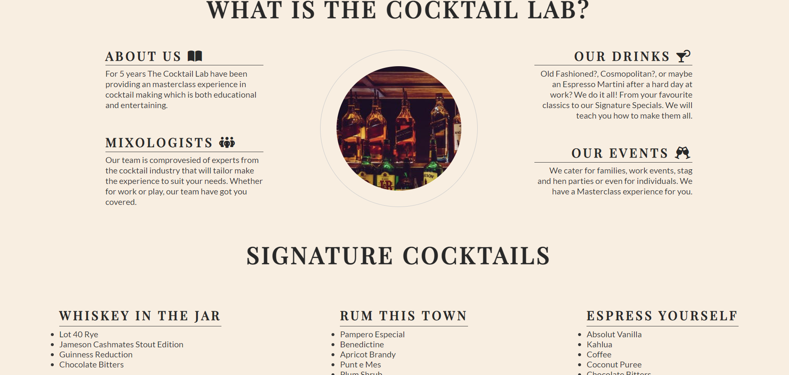
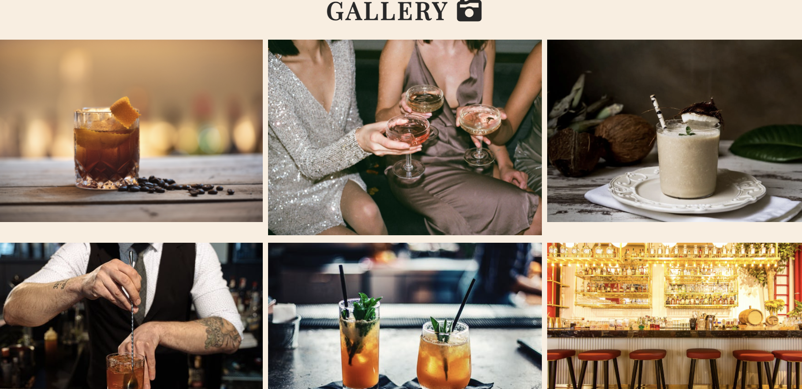
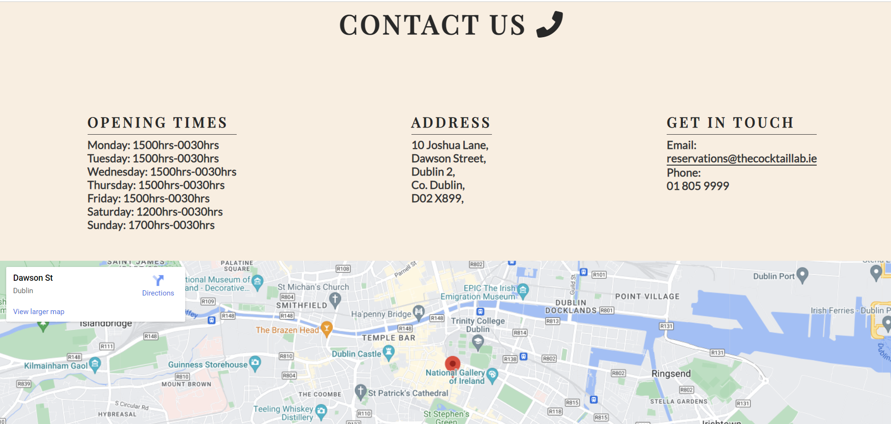
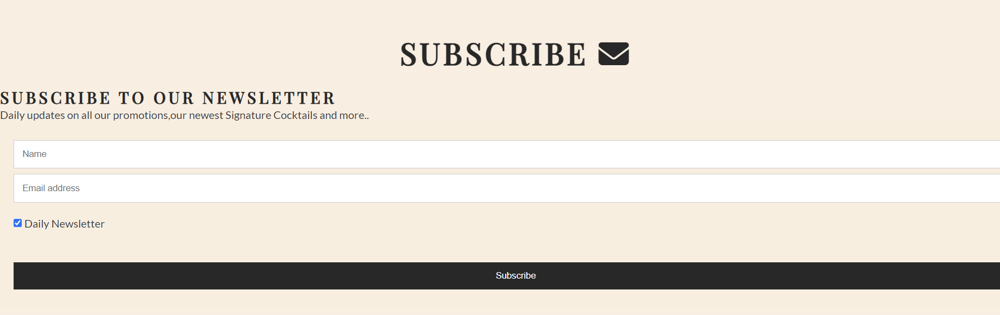

# The Cocktail Lab 
# Milestone Project 1 - Static Front End Website 

* DISCLAIMER: The Cocktail lab is a fictional company. This wedbsit is for the developers portfolio and for the comp;etion of the Code Institute milestone project 1. 

## Overview 

The Cocktail Lab is a Dublin based company that educates and entertains in the skill of cocktail making. Located in the heart of Dublin, The Cocktail Lab hosts Masterclasses where groups or individuals can learn all the skills needed to be a Mixoligist. Our site is targeted towards either individuals who are looking to get in the Mixology industry or anyone that enjoys making cocktails. The Cocktail Lab is useful in upskilling and/or providing and entertaing experience for individuals or groups. 

# Features 

## Existing Features

### Navigation Bar

* The Navigation Bar features at the top of the page and includes internal links to the Home, About Us, Gallery, Contact and Sign-Up sections of the website
* This Section will allow the user to easily navigate to different areas of the webpage without having to scroll continously, saving time and enhancing the User Experience.  

 

### Landing Page Image 

* This is an image used to immedietly capture the users attention. The image is big and bold and should intrigue to user to continue on the site. 
* The image is also relevant to The Cocktail Lab and is one of the signature cocktails, thus grabbing the users attention. 

 

### About Us 

* The What Is The Cocktail Lab section will give a broad overview of what the user can expect from The Cocktail Lab. It informs the user who we are and what we do. 
* This section has four subsections which makes it easy or the user to find the informtion he/she might need. 
* This section also features a Signature Drinks heading with showcases The Cocktail Labs three marquee cocktails and their ingredients. 

### Gallery 

* The Gallery section features a montage of photos from The Cocktail Lab Masterclasses. 
* Each photo is relevant in telling its own story to the user and the photos have been specially selected to go with the colour palette of the website. 

### Contact Us 

* This section features all the contact information a user would need to get in contact with The Cocktail lab including opening times, address and contact infotmation such as email and phone number. 
* This section also features a map where the user can find the location of the Cocktail Lab. 

### Sign-Up

* This section feature a form where the user can sign up to a weekly newsletter. 
* The purpose of the newsletter is to ensure the user gets the most up to date news on relating to The Cocktail lab, includoing promotions and offers. 
* the form is intentionally basic in nature as to encourgae the user to subscribe to the newsletter. 

