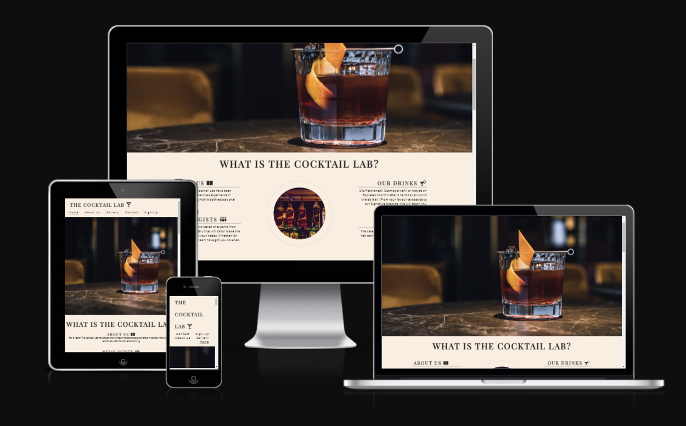
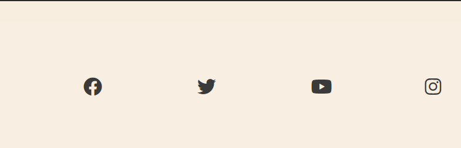

# The Cocktail Lab 
# Milestone Project 1 - Static Front End Website 

* DISCLAIMER: The Cocktail lab is a fictional company. This wedbsite is for the developers portfolio and for the competition of the Code Institute milestone project 1. 

## Overview 

The Cocktail Lab is a Dublin based company that educates and entertains in the skill of cocktail making. Located in the heart of Dublin, The Cocktail Lab hosts Masterclasses where groups or individuals can learn all the skills needed to be a Mixoligist. Our site is targeted towards either individuals who are looking to get in the Mixology industry or anyone that enjoys making cocktails. The Cocktail Lab is useful in upskilling and/or providing and entertaing experience for individuals or groups. 

# Features 

## Existing Features

### Navigation Bar

* The Navigation Bar features at the top of the page and includes internal links to the Home, About Us, Gallery, Contact and Sign-Up sections of the website
* This Section will allow the user to easily navigate to different areas of the webpage without having to scroll continously, saving time and enhancing the User Experience.  

 

### Landing Page Image 

* This is an image used to immedietly capture the users attention. The image is big and bold and should intrigue to user to continue on the site. 
* The image is also relevant to The Cocktail Lab and is one of the signature cocktails, thus grabbing the users attention. 

 

### About Us 

* The What Is The Cocktail Lab section will give a broad overview of what the user can expect from The Cocktail Lab. It informs the user who we are and what we do. 
* This section has four subsections which makes it easy or the user to find the informtion he/she might need. 
* This section also features a Signature Drinks heading with showcases The Cocktail Labs three marquee cocktails and their ingredients. 

### Gallery 

* The Gallery section features a montage of photos from The Cocktail Lab Masterclasses. 
* Each photo is relevant in telling its own story to the user and the photos have been specially selected to go with the colour palette of the website. 

### Contact Us 

* This section features all the contact information a user would need to get in contact with The Cocktail lab including opening times, address and contact infotmation such as email and phone number. 
* This section also features a map where the user can find the location of the Cocktail Lab. 

### Sign-Up

* This section feature a form where the user can sign up to a weekly newsletter. 
* The purpose of the newsletter is to ensure the user gets the most up to date news on relating to The Cocktail lab, includoing promotions and offers. 
* the form is intentionally basic in nature as to encourgae the user to subscribe to the newsletter. 

  

### Footer

* The Footer section includes links to relevant social media sites. The links will open in a new tab to allow easy navigtion for the user. 
* The footer is an essential part of the page as it allows to user to keep connected to The Cocktail Lab through various different Social Media platforms. 

 

## Future Features 

* In the future The Cocktail Lab would like in implement new features for the website including a video section where users can physically see our Mixoligists prepare our signature cocktails. 
* Another feature that The Cocktail Lab hopes to implement in the future is an online booking system to make it easier for the user to book masterclasses. 

# User Experience 

## User Stories 

1. First Time Visitor Goals
* As a First Time Visitor, i want to understand the main purpose of the website. 
* As a First Time Visitor, i want to know what the company does and is it what i am looking for. 
* As a First Time Visitor,  want to be able to easily navigate to the section of the webpage i am most interested in. 
*  As a First Time Visitor, i want to be able to easily locate the companys social media links to find more information if needed. 

2. Returning Visitor Goals 
* As a Returning Visitor, i want to find information that provides contact details and the loaction of the company. 
* As a Returning Visitor, i want to find any updates on the service the company provides. 
* As a Returning Visitor, i want to view any media the website has. 

3. Frequent User Goals
* As a Frequent Visitor, i want to be able to sign up to a news letter to ensure i get up to date information on events and promotions. 
* As a frequent Visitor, I want to be able to see if any new products or recipes have been added to the webpage. 

## Design 

* Colour Scheme
  - The main colours used for The Cocktail Lab website where a shade of cream and dark grey, this invites warmth for the user when looking atbthe page. 

* Typography
  - The font used for the headings was Playfair Display and for paragraph content it was Lato. Sans Serif was used as a fallback in case of the Google Fonts link not working. Playfair was used to ensure a level of sophistication and attractivness. 

* Imagery
    - Imagery is essential. The landing page image is designed to be eye catching and illict and element of desire for a cocktail, thus ensuring the user stays engages with the website. 
    - The colour profile of the images is warm to ensure it goes with the overall colour palette of the webpage 

## Technologies Used 

### Languages Used 

* HtML5
* CSS 

### Frameworks, Libraries and Programs Used 

1. Bootstrap
   - Bootstrap was used to assist with the responsiveness and styling of the website.

2.  Google Fonts 
    - Google fonts were used to import the 'Titillium Web' font into the style.css file which is used on all pages throughout the project.

3. Font Awesome 
    - Font Awesome was used on all pages throughout the website to add icons for aesthetic and UX purposes.

4. Pexels 
     - Pexels was used to get the stock photos that are visible throughout the project.     

